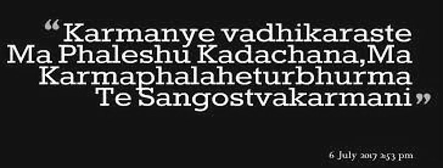

# Homework 2

This repository contains images, their cleaned versions, and an already cleaned version

## Images

### Cleaned Image

### Original Image

### Second Original Image

---

## Output Files

- `output.txt`: Raw OCR output for `image.png`
- `output2.txt`: Raw OCR output for `image2.png`
- `output_cleaned.txt`: OCR output for `cleaned.png`

## Scripts

- `tesseract.py`: Python script to perform OCR using Tesseract.
- `test.py`: Script for testing OCR functionality.

---
Generated on: `$(date)`  
