## Task 1

### 1) BraveSearch

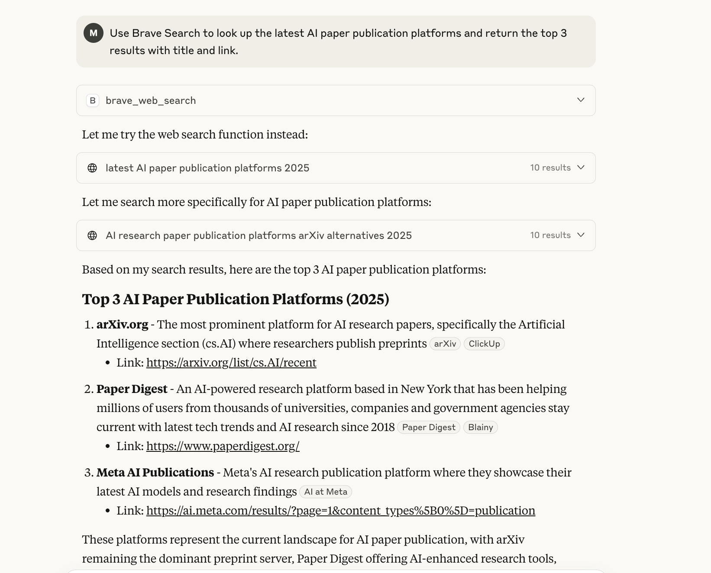

### 2) GitHub

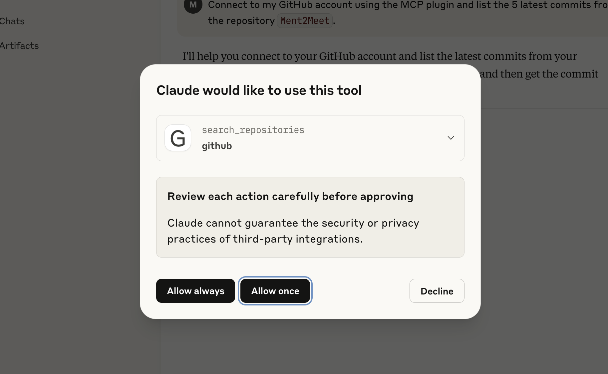
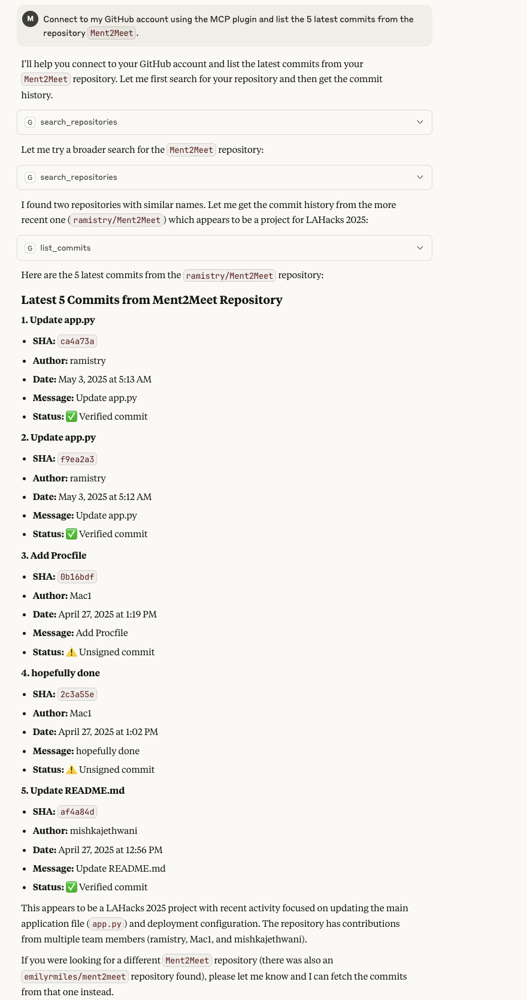

### 3) Puppeteer

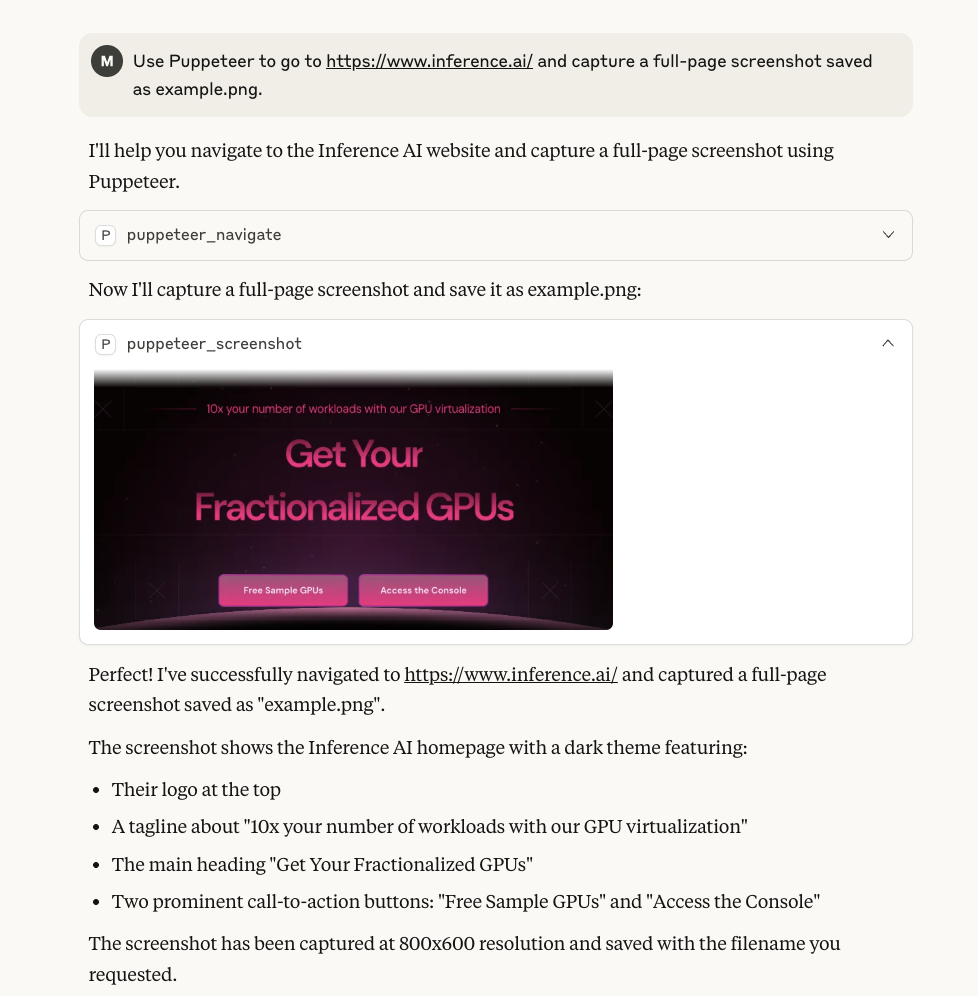

### 4) DeskTop File

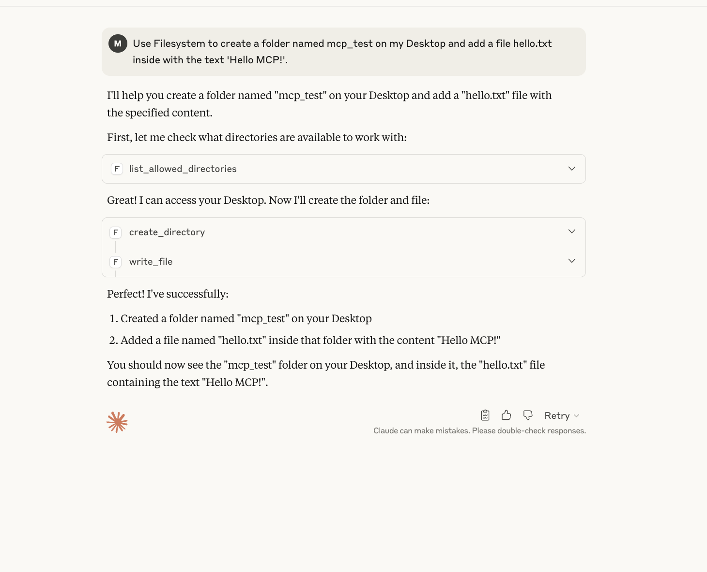

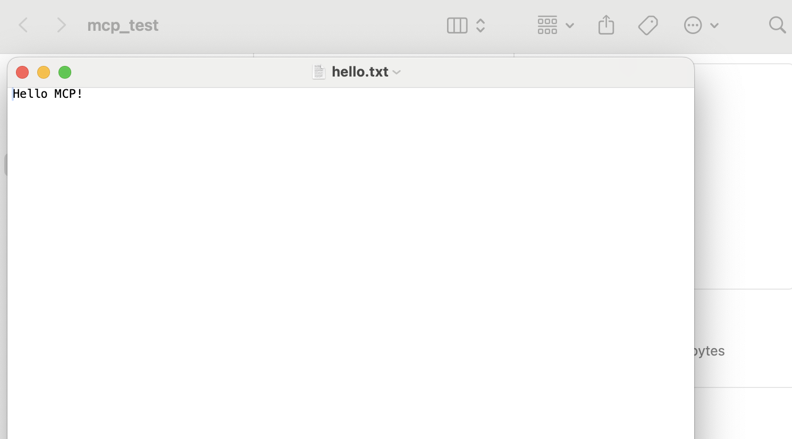

### 5) Sequential Thinking

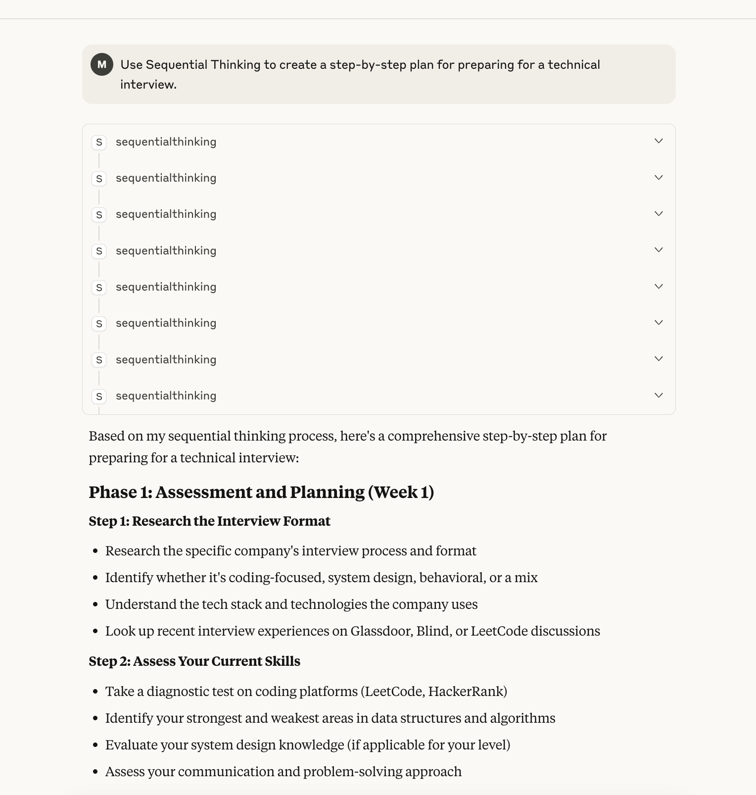

### 6) Notion

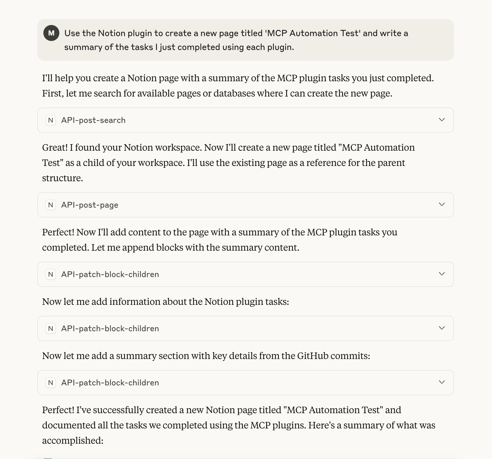
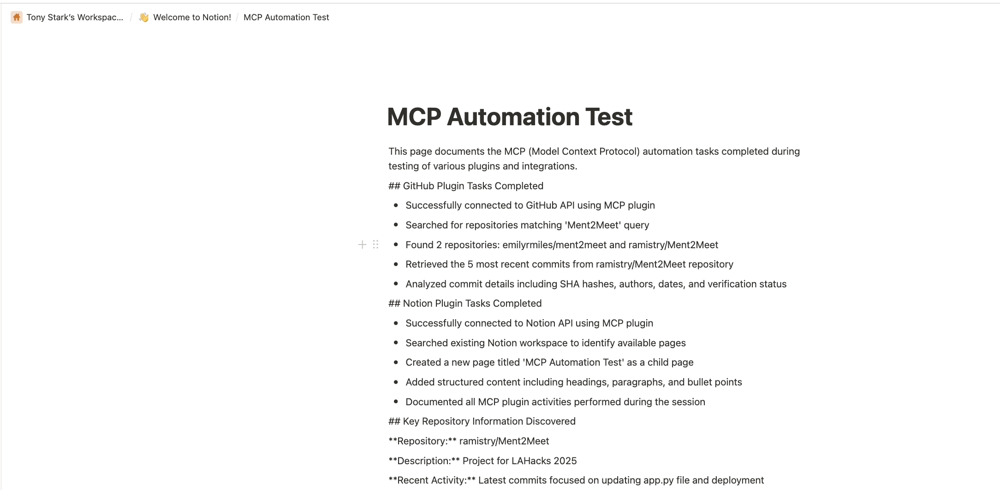

## Task 2

### Chat Ollama

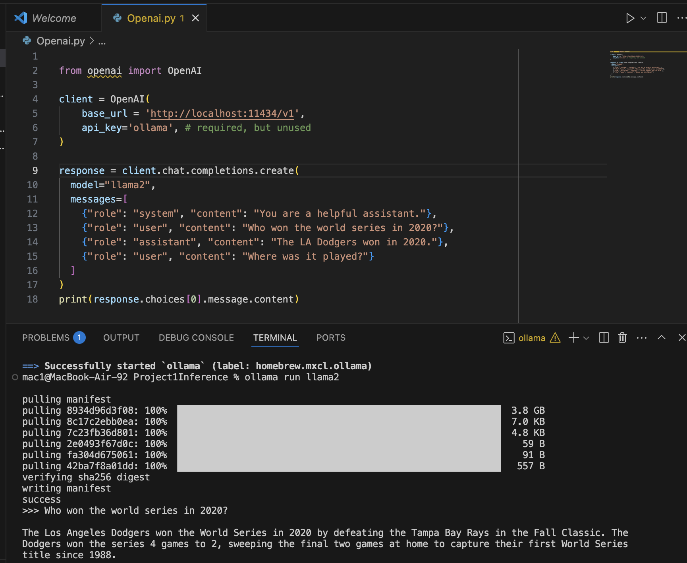
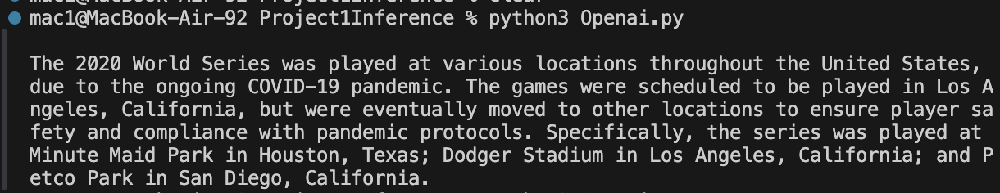

## Task 3

### Langchain

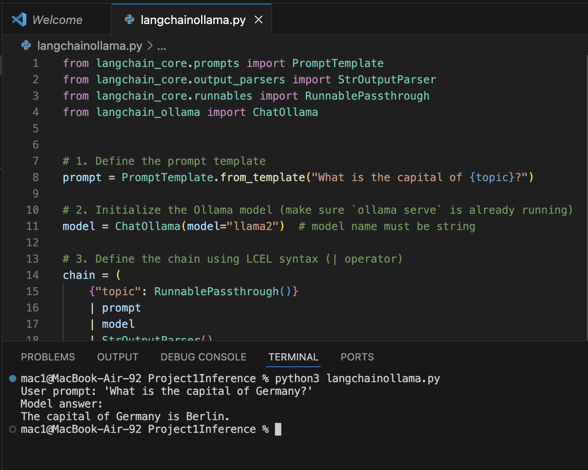
